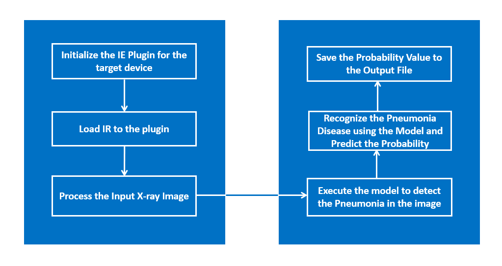
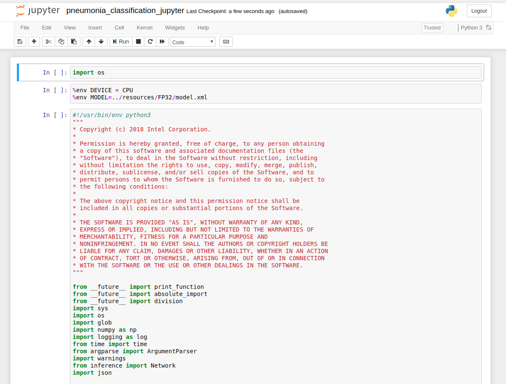

# Healthcare Application - Pneumonia Classification

| Details               |                   |
| --------------------- | ----------------- |
| Target OS:            | Ubuntu* 16.04 LTS |
| Programming Language: | Python* 3.5       |
| Time to Complete:     | 30 min            |


## What it does
This reference implementation showcases a health care application performing pneumonia classification on X-ray images, it demonstrates the method of Class Activation Maps with OpenVINO, it also shows with the help of heatmap which regions the network looked to make its choice.

## Requirements

### Hardware

- 6th to 8th generation Intel® Core™ processors with Iris® Pro graphics or Intel® HD Graphics

### Software

- [Ubuntu\* 16.04 LTS](http://releases.ubuntu.com/16.04/)<br>
  NOTE: Use kernel versions 4.14+ with this software.<br> 
  Determine the kernel version with the below uname command. 

  ```
   uname -a
  ```

- Intel® Distribution of OpenVINO™ toolkit 2019 R3 release
* Jupyter* Notebook v5.7.0

## How It works

The application uses the Inference Engine included in the Intel® Distribution of OpenVINO™ toolkit. It uses X-ray image as an input source. A trained neural network detects pneumonia probability of preprocessed X-ray image. And it stores the probability and inference time value in a file. 


**Architectural Diagram**

## Setup

### Get the code

Clone the reference implementation:

    sudo apt-get update && sudo apt-get install git
    git clone https://gitlab.devtools.intel.com/reference-implementations/pneumonia-classification-python.git

### Install Intel® Distribution of OpenVINO™ toolkit

Refer to [Install Intel® Distribution of OpenVINO™ toolkit for Linux*](https://software.intel.com/en-us/articles/OpenVINO-Install-Linux) to learn how to install and configure the toolkit.

Install the OpenCL™ Runtime Package to run inference on the GPU, as shown in the instructions below. It is not mandatory for CPU inference.

### Which model to use
This application uses a pre-trained [model](resources/model/model.pb), that is provided in the /resources directory. This model is trained using the dataset found in [https://data.mendeley.com/datasets/rscbjbr9sj/2](https://data.mendeley.com/datasets/rscbjbr9sj/2), made available under the [(CC BY-SA 4.0)](https://creativecommons.org/licenses/by-sa/4.0/) license. Instructions on how to train the model can also be found there. This model needs to be passed through the **model optimizer** to generate the IR (the **.xml** and **.bin** files) that will be used by the application.

To install the dependencies of the RI, run the following commands:

  ```
  cd <path_to_the_pneumonia-classification-python_directory>
  ./setup.sh
  ```
 
### The Config File

The _resources/config.json_ contains the path to the images that will be used by the application.  

The _config.json_ file is of the form name/value pair, `image: <path/to/imagefile>`   

The application can use any number of images for detection.

### Which Input Image to use

The application works with any input X-ray input image. For first-use, we recommend using the [NORMAL](../resources/NORMAL) and [PNEUMONIA](../resources/NORMAL) images.
For example: <br>
The config.json would be:

```
{

    "inputs": [
	    {
            "image": "resources/NORMAL/*.jpeg"
        },
        {
            "image": "resources/PNEUMONIA/*.jpeg"
        }
    ]
}
```
To use any other image, specify the path in config.json file

## Setup the environment
You must configure the environment to use the Intel® Distribution of OpenVINO™ toolkit one time per session by running the following command:

    source /opt/intel/openvino/bin/setupvars.sh -pyver 3.5
    
__NOTE__: This command needs to be executed only once in the terminal where the application will be executed. If the terminal is closed, the command needs to be executed again.

## Run the application on Jupyter*

* Go to the _pneumonia-classification-python_ directory and open the Jupyter notebook by running the following command:

      cd <path_to_the_pneumonia-classification-python_directory>/Jupyter

      jupyter notebook
    **NOTE:** Before running the application on the FPGA, set the environment variables and  program the AOCX (bitstream) file.<br>

    Set the Board Environment Variable to the proper directory:

    ```
    export AOCL_BOARD_PACKAGE_ROOT=/opt/intel/openvino/bitstreams/a10_vision_design_sg<#>_bitstreams/BSP/a10_1150_sg<#>
    ```
    **NOTE:** If you do not know which version of the board you have, please refer to the product label on the fan cover side or by the product SKU: Mustang-F100-A10-R10 => SG1; Mustang-F100-A10E-R10 => SG2 <br>

    Set the Board Environment Variable to the proper directory:
    ```
    export QUARTUS_ROOTDIR=/home/<user>/intelFPGA/18.1/qprogrammer
    ```
    Set the remaining environment variables:
    ```
    export PATH=$PATH:/opt/altera/aocl-pro-rte/aclrte-linux64/bin:/opt/altera/aocl-pro-rte/aclrte-linux64/host/linux64/bin:/home/<user>/intelFPGA/18.1/qprogrammer/bin
    export INTELFPGAOCLSDKROOT=/opt/altera/aocl-pro-rte/aclrte-linux64
    export LD_LIBRARY_PATH=$LD_LIBRARY_PATH:$AOCL_BOARD_PACKAGE_ROOT/linux64/lib
    export CL_CONTEXT_COMPILER_MODE_INTELFPGA=3
    source /opt/altera/aocl-pro-rte/aclrte-linux64/init_opencl.sh
    ```
    **NOTE:** It is recommended to create your own script for your system to aid in setting up these environment variables. It will be run each time you need a new terminal or restart your system.

    The bitstreams for HDDL-F can be found under the `/opt/intel/openvino/bitstreams/a10_vision_design_sg<#>_bitstreams/` directory.<br><br>To program the bitstream use the below command:<br>
    ```
    aocl program acl0 /opt/intel/openvino/bitstreams/a10_vision_design_sg<#>_bitstreams/2019R3_PV_PL1_FP11_RMNet.aocx
    ```

    For more information on programming the bitstreams, please refer the [link](https://software.intel.com/en-us/articles/OpenVINO-Install-Linux-FPGA#inpage-nav-11).


**Follow the steps to run the code on Jupyter:**


1. Click on **New** button on the right side of the Jupyter window.

2. Click on **Python 3** option from the drop down list.

3. In the first cell type **import os** and press **Shift+Enter** from the keyboard.

4. Export the below environment variables in second cell of Jupyter and press **Shift+Enter**.<br>
       
       %env DEVICE = CPU
       %env MODEL=../resources/FP32/model.xml

4. If user wants to save the output result files (output images, results.txt and stats.txt) in specific directory then export environment variable (directory) in the next cell as given below and press **Shift+Enter**.<br>
   **NOTE:** If user skips this step then output files (output images, results.txt and stats.txt) are saved in the __output__ directory itself.<br>
   
       %env OUTPUT = <path_to_the_required_directory_to_save_the_output_files> 
    
   **results.txt**: This file contains the probability of pneumonia message and inference time

    **stats.txt**: This file contains the total average inference time
    
5. If user wants to specify the number of iteration value and performance counts, then export these environment variables(ITERATION_NUM, PERFS_COUNT) as given below to get accurate results and press **Shift+Enter**.<br>
   **NOTE:** If user skips this step, these values are set to default values.<br>
   
       %env ITERATION_NUM = 20
       %env PERFS_COUNT = True
  
6.  Copy the code from **pneumonia_classification_jupyter.py** and paste it in the next cell and press **Shift+Enter**.

7. Alternatively, code can be run in the following way.

    i. Click on the **pneumonia_classification_jupyter.ipynb** file in the Jupyter notebook window.
    
    ii. Click on the **Kernel** menu and then select **Restart & Run All** from the drop down list.
    
    iii. Click on Restart and Run All Cells.



**NOTE:**

1. To run the application on **GPU**:
     * With the floating point precision 32 (FP32), change the **%env DEVICE = CPU** to **%env DEVICE = GPU**<br>
        **FP32**: FP32 is single-precision floating-point arithmetic uses 32 bits to represent numbers. 8 bits for the magnitude and 23 bits for the precision. For more information, [click here](https://en.wikipedia.org/wiki/Single-precision_floating-point_format)<br>

     * With the floating point precision 16 (FP16), change the environment variables as given below:<br>
        
           %env DEVICE = GPU
           %env MODEL=../resources/FP16/model.xml
           
       **FP16**: FP16 is half-precision floating-point arithmetic uses 16 bits. 5 bits for the magnitude and 10 bits for the precision. For more information, [click here](https://en.wikipedia.org/wiki/Half-precision_floating-point_format)

2. To run the application on **Intel® Neural Compute Stick**: 
      * Change the **%env DEVICE = CPU** to **%env DEVICE = MYRIAD**
      * The Intel® Neural Compute Stick can only run FP16 models. Hence change the environment variable for the model as shown below. <br>
      
            %env MODEL=../resources/FP16/model.xml

3. To run the application on **Intel® Movidius™ VPU**: 
      * Change the **%env DEVICE = CPU** to **%env DEVICE = HDDL**
      * The Intel® Movidius™ VPU can only run FP16 models. Hence change the environment variable for the model as shown below. <br>
      
            %env MODEL=../resources/FP16/model.xml

4. To run the application on **Intel® Arria® 10 FPGA**:
      * Change the **%env DEVICE = CPU** to **%env DEVICE = HETERO:FPGA,CPU**
      * With the **floating point precision 16 (FP16)**, change the path of the model in the environment variable **MODEL** as given below:<br>

            %env MODEL=../resources/FP16/model.xml

5. To run the application on multiple devices: <br>
   For example:
      * Change the **%env DEVICE = CPU** to **%env DEVICE = MULTI:CPU,GPU,MYRIAD**
      * With the **floating point precision 16 (FP16)**, change the path of the model in the environment variable **MODEL** as given below: <br>
            %env MODEL=../resources/FP16/model.xml
